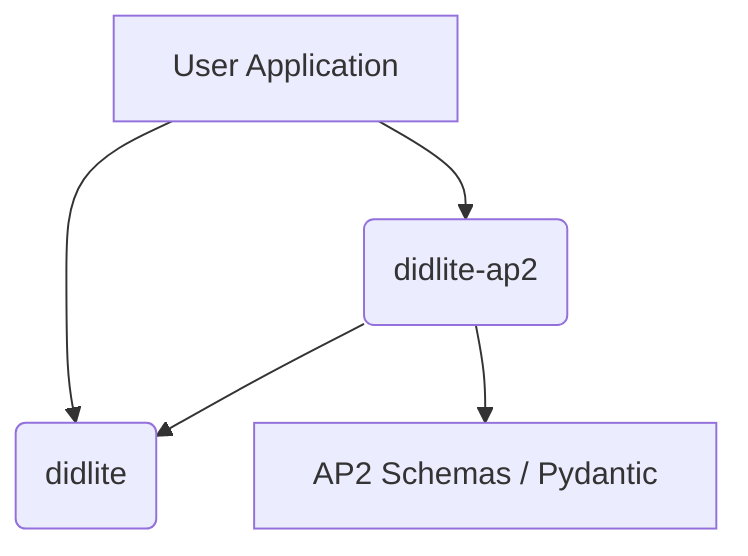

# Design Recommendation: `didlite-ap2` Plugin

## Executive Summary
This document outlines the architecture for `didlite-ap2`, an optional extension package that enables specific Google Agent Payment Protocol (AP2) functionality—specifically Mandate signing and verification—while preserving the "zero-bloat" philosophy of the core `didlite` library.

## 1. Architecture Overview

### Philosophy
- **Core `didlite`**: Remains focused on primitive Identity generation and generic JWS signing. No AP2 awareness.
- **Extension `didlite-ap2`**: A separate PyPI package (`pip install didlite-ap2`) that depends on `didlite`. It imports the core identity objects and wraps them with AP2-specific business logic.

### Dependency Graph


## 2. Technical Implementation

### Package Structure
The plugin should be published as a separate namespace package or standalone package to avoid pollinguting the core.
```text
didlite-ap2/
├── setup.py           # dependencies: didlite>=0.1.5, pydantic>=2.0
├── didlite_ap2/
│   ├── __init__.py
│   ├── models.py      # AP2 Mandate Schemas (Intent, Cart, Payment)
│   ├── signer.py      # Logic to wrap didlite.AgentIdentity
│   └── verifier.py    # Logic to verify AP2 specific claims
```

### Core Components

#### A. Mandate Models (The "What")
Use `pydantic` (optional in core, required here) to enforce the rigorous structure of AP2 Mandates. This ensures that what is signed is valid **before** crypto operations.

```python
# didlite_ap2/models.py
from pydantic import BaseModel, Field
from typing import List, Optional

class IntentMandate(BaseModel):
    intent_id: str
    description: str
    max_amount: float
    currency: str = "USD"
    # ... other AP2 specific fields

class CartMandate(BaseModel):
    items: List[dict]
    total_amount: float
    merchant_id: str
```

#### B. The AP2 Signer (The "How")
A wrapper class that accepts a `didlite.AgentIdentity` and signs structured Mandates.

```python
# didlite_ap2/signer.py
from didlite import AgentIdentity, create_jws
from .models import IntentMandate

class AP2Agent:
    def __init__(self, identity: AgentIdentity):
        self.identity = identity

    def sign_intent(self, mandate: IntentMandate) -> str:
        """
        Signs an AP2 Intent Mandate.
        Returns a JWS token compliant with AP2 signature requirements.
        """
        # 1. Serialize Mandate to dict (canonicalization if needed)
        payload = mandate.model_dump()
        
        # 2. Add AP2 specific headers if required (e.g. 'typ': 'ap2-intent+jwt')
        headers = {"typ": "ap2-intent+jwt"}
        
        # 3. Use core didlite to sign
        return create_jws(self.identity, payload, headers=headers)
```

#### C. Verification
```python
# didlite_ap2/verifier.py
from didlite import verify_jws
from .models import IntentMandate

def verify_ap2_token(token: str) -> IntentMandate:
    # 1. Verify Crypto Signature using core didlite
    payload = verify_jws(token)
    
    # 2. Verify Schema Compliance
    return IntentMandate(**payload)
```

## 3. Integration Example

**Scenario**: An Autonomous Commerce Agent ("ShopBot") finds a product and needs to authorize a purchase under $50.

```python
import didlite
from didlite_ap2 import AP2Agent, IntentMandate

# 1. Core Identity (Lightweight, fast)
agent_id = didlite.AgentIdentity() 

# 2. AP2 Capabilities (Structured, safe)
ap2_agent = AP2Agent(agent_id)

# 3. Define the Mandate
intent = IntentMandate(
    intent_id="uuid-1234",
    description="Purchase 5x Raspberry Pi 5",
    max_amount=500.00
)

# 4. Sign format-compliant AP2 token
token = ap2_agent.sign_intent(intent)

print(f"AP2 Token: {token}")
# Output: eyJhbGciOiJFZERTQ... (Ready for Payment Gateway)
```

## 4. Recommendation for Plugin System
The `FUTURE_UPGRADES.md` mentions a future plugin system. For AP2:
1.  **Do not** build a complex "plugin registry" inside `didlite` core yet.
2.  **Do** use standard Python composition. The `AP2Agent(identity)` pattern is cleaner and Pythonic.
3.  **Future Proofing**: If `didlite` adds `didlite.register_extension()`, this package can easily add a hook.

## 5. Next Steps
1.  Monitor `docs/FUTURE_UPGRADES.md` for consensus on the plugin approach.
2.  Prototype `didlite-ap2` locally to validate that `didlite.create_jws` is flexible enough for AP2 headers (it requires `headers` arg support).
    *   *Note: Current `didlite` might need a minor update to allow custom JWS headers if AP2 requires specific `typ` or `kid` formatting.*
